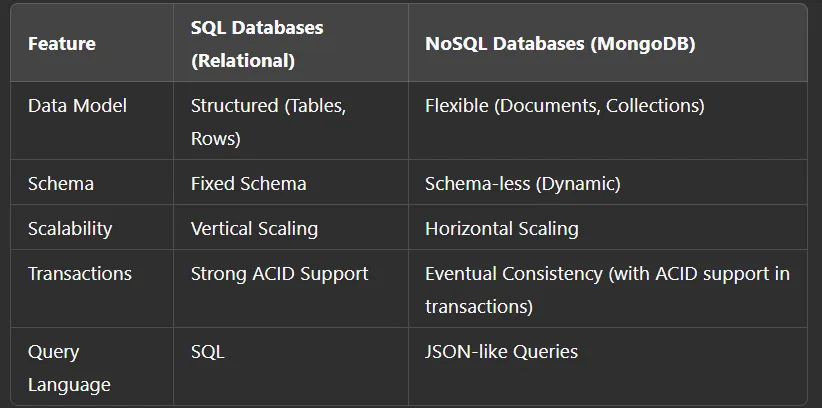

# Setup & Fundamentals of MongoDB

## Introduction to MongoDB

### What is MongoDB?

MongoDB is a NoSQL, document-oriented database designed for high performance, scalability, and flexibility. Unlike traditional relational databases, MongoDB stores data in JSON-like BSON documents, allowing for dynamic and schema-less structures

### Overview of MongoDB architecture

MongoDB is a NoSQL database that stores data in a flexible, document-oriented format rather than the traditional row and column format used by relational databases. The architecture of MongoDB is designed to provide high availability, scalability, and performance. Here’s an overview of its key components:

**1. **Database:**

- MongoDB organizes data into databases. Each database can contain multiple collections.

- A database is essentially a container for collections and their documents. Each MongoDB server can have multiple databases.

**2. Collection:**

- Collections are the equivalent of tables in relational databases. A collection holds multiple documents.

- Unlike relational tables, collections do not require a predefined schema, allowing flexibility in the structure of stored documents.

**3. Document:**

- The basic unit of data in MongoDB is the document, which is a JSON-like BSON (Binary JSON) object. BSON is a binary representation of JSON objects.

- A document is composed of key-value pairs, and the values can be various types, including arrays, embedded documents, or basic types like strings, integers, and dates.

**4. Replica Set:**

- Replica sets provide high availability and redundancy. A replica set consists of a primary node and one or more secondary nodes that replicate the data of the primary.

- If the primary node fails, one of the secondary nodes is automatically promoted to primary, ensuring that the database remains available.

**5. Sharding:**

- Sharding is MongoDB’s way of distributing data across multiple servers (or clusters). This allows MongoDB to handle very large datasets and high-throughput operations.

- A shard is a horizontal partition of data. Each shard contains a subset of the data, and MongoDB uses a shard key to distribute data among shards.

- Sharding allows MongoDB to scale out horizontally across multiple machines, improving both read and write performance.

**6. Mongos:**

- Mongos is a routing service that directs client requests to the appropriate shard in a sharded cluster. Clients connect to mongos instances, which then forward requests to the correct shard based on the data location and shard key.

**7. Config Servers:**
Config servers store metadata and configuration settings for the sharded cluster, such as the mapping of data chunks to shards and information about the cluster topology.

- Typically, there are three config servers in a sharded cluster to ensure redundancy and fault tolerance.

**8. Journaling:**

- Journaling is used to ensure data durability. MongoDB writes changes to a journal file before applying them to the actual data files, helping to recover data in case of a crash.

**9. Storage Engine:**

- MongoDB supports multiple storage engines, such as the WiredTiger engine (default) and MMAPv1. The storage engine manages how data is stored on disk.

- The WiredTiger engine is designed for high concurrency and provides features like compression and document-level locking.

**10. Aggregation Framework:**

- The Aggregation Framework is used for data processing and transformation. It allows you to perform operations like filtering, sorting, grouping, and joining data.

- MongoDB also supports MapReduce for complex data processing tasks, although it is now less commonly used in favor of the aggregation framework.

**11. Indexing:**

- MongoDB supports various types of indexes to improve query performance, including single-field indexes, compound indexes, geospatial indexes, and text indexes.

- Indexes help MongoDB quickly locate documents, reducing the amount of data that needs to be scanned.

**12. Write Concern & Read Concern:**

- Write Concern determines the level of acknowledgment required for a write operation. It can be configured to ensure the write is acknowledged by a certain number of replica nodes.

- Read Concern defines the consistency and isolation properties of the data read from the database.

#### Key Features of MongoDB's Architecture

- **Scalability:** MongoDB's horizontal scaling with sharding allows it to handle large amounts of data by distributing the load across multiple servers.

- **Flexibility:** Documents within a collection can have different structures, making MongoDB suitable for unstructured and semi-structured data.

- **Replication:** Replica sets ensure data availability and provide failover capabilities.

- **Aggregation:** The powerful aggregation framework allows for complex data operations.

By combining these features, MongoDB provides a flexible, scalable, and high-performance database solution, especially suited for applications with large-scale, dynamic data requirements.

### Differences Between SQL and NoSQL



### Use Cases and Benefits of MongoDB

- **Big Data & Analytics**: Handles large volumes of unstructured data efficiently.
- **Content Management Systems**: Great for storing dynamic and hierarchical data.
- **IoT Applications**: Handles time-series and real-time data effectively.
- **E-commerce**: Supports fast reads and writes for product catalogs and orders.

## Installing MongoDB Locally

### Installing MongoDB on Windows

#### Option 1: Install via MongoDB MSI Installer

*1.* Go to [MongoDB Download Center](https://www.mongodb.com/try/download/community) and download the Windows MSI installer.
*2.* Run the installer and follow the setup wizard.

- Select **Complete Installation**.
- Ensure the option **Run MongoDB as a Service** is checked.

*3.* After installation, open Command Prompt and verify installation

```shell
mongod --version
```

**Option 2**: Install via Chocolatey (Alternative)

```shell
choco install mongodb-community
```

### Installing MongoDB on macOS

#### Option 1: Install via Homebrew

```shell
brew tap mongodb/brew
brew install mongodb-community
```

#### Option 2: Manual Installation

1. Download MongoDB from [MongoDB Download Center](https://www.mongodb.com/try/download/community).
2. Extract and move it to /usr/local/.
3. Start MongoDB manually

```shell
mongod --dbpath ~/data/db
```

### Installing MongoDB on Linux (Ubuntu/Debian)

```shell
wget -qO - https://www.mongodb.org/static/pgp/server-6.0.asc | sudo apt-key add -
echo "deb [ arch=amd64,arm64 ] https://repo.mongodb.org/apt/ubuntu focal/mongodb-org/6.0 multiverse" | sudo tee /etc/apt/sources.list.d/mongodb-org-6.0.list
sudo apt update
sudo apt install -y mongodb-org
sudo systemctl start mongod
sudo systemctl enable mongod
```

## Running MongoDB and Using the MongoDB Shell (mongosh)

After installation, start the MongoDB service:

```shell
mongod
```

Then, open a new terminal and run:

```shell
mongosh
```

## Creating Databases and Collections

In mongosh, you can create a database and a collection as follows

```shell
use myDatabase
db.createCollection("myCollection")
```

To insert data:

```shell
db.myCollection.insertOne({ name: "John Doe", age: 30 })
```

## Setting Up MongoDB Atlas (Cloud)

### Creating a Free Cluster on MongoDB Atlas

1. Go to [MongoDB Atlas](https://www.mongodb.com/cloud/atlas/register) and sign up.
2. Click Create a New Cluster and select a free-tier cluster.
3. Choose a cloud provider (AWS, GCP, or Azure) and region.
4. Click Create Cluster and wait for the setup to complete.

### Connecting to MongoDB Atlas from Your Local Machine

*1.* In the Atlas UI, go to Database > Connect.
*2.* Select Connect Your Application.
*3.* Copy the connection string:

```shell
mongodb+srv://<username>:<password>@cluster0.mongodb.net/test
```

*4.* Use it in mongosh:

```shell
mongosh "mongodb+srv://<username>:<password>@cluster0.mongodb.net/test"
```

### Managing Users and Permissions

1. In the Atlas UI, go to Database Access.
2. Click Add New Database User.
3. Set up a username and password with appropriate permissions.
4. Go to Network Access and add your IP address (0.0.0.0/0 allows all IPs).
