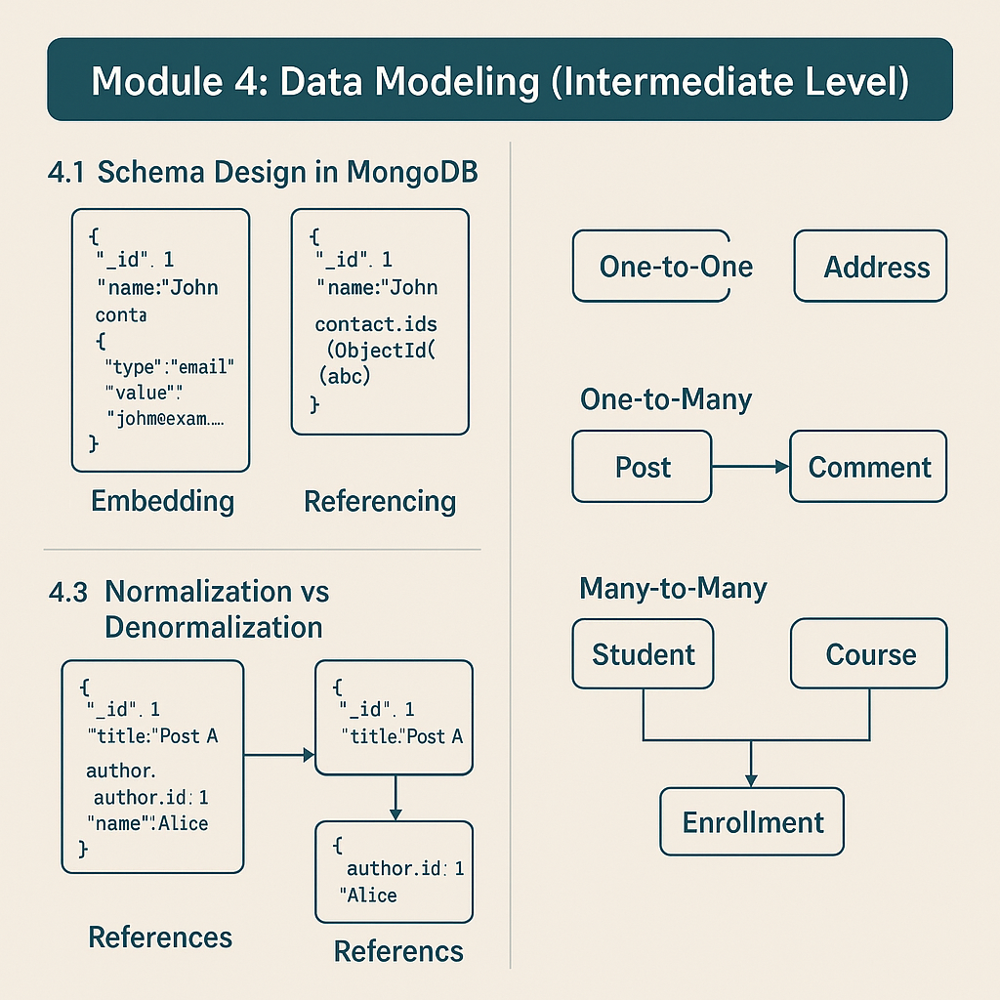

# Data Modeling

## Schema Design in MingoDB

### Understanding the Advantages of Schema-less Design

- **Flexibility:** MongoDB collections do not enforce document structure, allowing for rapid iteration and changes.

- **Heterogeneous Data:** Documents in the same collection can have different fields, structures, and types.

- **Easier Scaling:** As needs change, documents can evolve without major migration efforts.

**:bulb:** **However:** "Schema-less" doesn't mean "no structure." Good applications still enforce a logical schema at the application level.

### Embedding vs. Referencing

- **Embedding (Nested Documents):**
  - Child data is included directly within the parent document.
  - Best for one-to-few relationships.
  - Pros: Fast reads (single document access), transactional updates.
  - Cons: Large documents can grow too big (MongoDB
  has a 16MB document size limit).
- **Referencing (Using ObjectIDs or manual IDs):**
  - Documents are stored separately and linked via an identifier.
  - Best for one-to-many or many-to-many relationships where children are large or independently accessed.
  - Pros: Smaller document size, avoids duplication.
  - Cons: Requires additional queries or joins (using `$lookup`).

### Best Practices for Schema Design in MongoDB

- Model data based on ***application queries***, not just structure.
- Embed when you have ***high read/write locality***.
- Reference when documents are ***accessed independently***.
- Avoid deep nesting (usually 1–2 levels deep is optimal).
- Use ***consistent naming conventions*** for fields.
- Leverage ***indexes*** wisely for performance.

## Normalization vs. Denormalization

### When to Use Embedded Documents (Denormalization)

- Data is ***read together*** most of the time.
- Data is ***not too large*** and changes ***rarely*** or predictably.
- Performance needs favor fewer database hits.
**Example:**

```javascript
{
  "order_id": 123,
  "customer": {
    "name": "Alice",
    "email": "alice@example.com"
  },
  "items": [
    { "product_id": "abc123", "quantity": 2 },
    { "product_id": "xyz789", "quantity": 1 }
  ]
}
```

### When to Use References (Normalization)

- Child data is ***large***, ***frequently updated***, or ***accessed independently***.
- Relationships are ***many-to-many***.
- Data duplication would cause consistency issues.

#### Manual References vs. DBRef

- ***Manual Reference:*** Just storing an _id or another key explicitly.

- ***DBRef:*** MongoDB’s built-in referencing format. Rarely used nowadays because it adds lookup complexity and is slower.
:hammer_and_pick: ***Recommendation:*** Prefer manual references for better control and performance.

## Relationships in MongoDB

### One-to-One Relationship

- ***Embedding*** is often preferred.
- Example: A user profile containing user settings.

```javascript
{
  "_id": "user123",
  "name": "John Doe",
  "settings": {
    "theme": "dark",
    "notifications": true
  }
}
```

### One-to-Many Relationship

- ***Embed*** if the many side is small and tightly coupled.
- ***Reference*** if the many side is large or accessed independently.

Example (Reference):

```javascript
//  User document
{
  "_id": "user123",
  "name": "John Doe"
}

// Posts collection
{
  "_id": "post567",
  "user_id": "user123",
  "content": "Hello world!"
}
```

### Many-to-Many Relationship

- Always ***reference***.
- Optionally use an ***intermediate collection*** ("join table" pattern).

Example:

```javascript
// Students collection
{
  "_id": "student123",
  "name": "Alice"
}

// Courses collection
{
  "_id": "course456",
  "title": "Database Systems"
}

// Enrollments (junction collection)
{
  "student_id": "student123",
  "course_id": "course456"
}
```

### Modeling Complex Relationships in MongoDB

- Use ***embedding*** + ***referencing*** mixed approaches carefully.
- Optimize for ***the most frequent queries***.
- A***ggregation pipelines*** (`$lookup`, `$unwind`, `$group`) help simulate SQL-style joins when needed.

## :white_check_mark: Quick Summary

| Strategy | When to Use |
|:---|:---|
| Embedding | Small, frequently-read together, tightly coupled data |
| Referencing | Large, independently accessed, frequently updated data |
| Denormalization | Improves read performance but can risk data duplication |
| Normalization | Ensures consistency but may require more queries |


