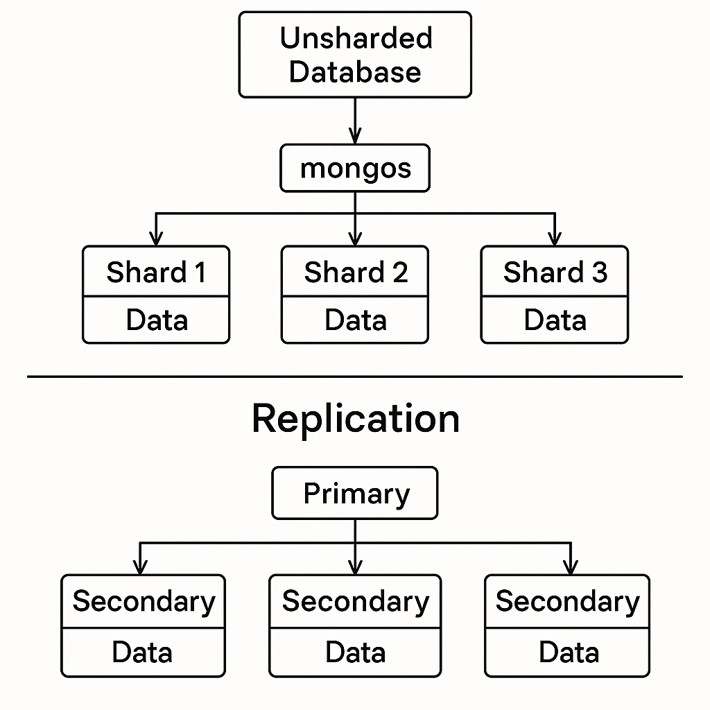

# Performance Optimization and Best Practices

## Index Optimization

### Compound Indexes and Their Impact

A ***compound index*** is an index on multiple fields in a document.

- Example: An index on `{ "lastName": 1, "firstName": 1 }`.

- Impact:
  - Speeds up queries that use the indexed fields together.
  - Supports ***prefix queries*** (queries on the leading fields of the index).
  - Reduces the need for multiple single-field indexes.
  - But ***too many indexes*** (especially large compound ones) can slow down write operations (inserts/updates).

### Indexing Strategies for Read-Heavy vs. Write-Heavy Workloads

- **Read-Heavy Applications:**
  - Create more indexes to optimize different query patterns.
  - Use compound indexes that match frequent queries.
  - Consider ***covered queries*** (queries answered entirely by the index).

- **Write-Heavy Applications:**
  - Minimize indexes because every index needs updating on write.
  - Carefully select only the most necessary indexes.

### Indexing Performance Considerations

- Indexes consume RAM — ensure indexes fit into memory.
- Analyze queries with `explain()` to understand index usage.
- Regularly review and drop unused indexes (`db.collection.dropIndex()`).
- Monitor index build times for large datasets.

## Sharding in MongoDB

### What is Sharding and Why is It Needed?

***Sharding*** = Horizontal partitioning of data across multiple servers.
Needed when:

- Single server can no longer store or process all the data.
- Workload exceeds a server’s CPU, memory, or IOPS capabilities.
- Sharding improves scalability and performance.

### Configuring a Sharded Cluster

Components:

- ***Shard Servers*** (store actual data),
- ***Config Servers*** (store cluster metadata),
- ***Query Routers*** (***mongos***) (interface between client and sharded cluster).
Setup Steps:

1. Deploy config servers.
2. Deploy shard servers.
3. Start mongos routers.
4. Enable sharding on database and collections.

### Choosing Shard Keys Wisely

Important points:

- ***Even Data Distribution***: Avoid hotspots. Choose keys that distribute data evenly.
- ***Query Targeting***: Choose keys based on common query patterns.
- ***Cardinality***: Prefer high-cardinality fields (many unique values).
- Bad shard key = cluster imbalance = performance bottleneck.

## Replication in MongoDB

### Introduction to MongoDB Replication

- Replication = Copying data across multiple servers (replica set).

- Provides ***high availability*** and data ***redundancy***.

### Setting up Replica Sets

Steps:

1. Start multiple `mongod` instances.
2. Connect to one instance and initiate the replica set (`rs.initiate()`).
3. Add other nodes (`rs.add("hostname:port")`).
4. MongoDB elects a primary; others are secondaries.

### Write and Read Concerns in Replica Sets

- ***Write Concern:*** How many nodes must acknowledge a write.
Examples: `w: 1` (primary only), `w: majority` (majority of nodes).

- ***Read Concern:*** Guarantees on the data being read.
Examples: `local`, `majority`, `linearizable`.

## Handling Large Data

### Using GridFS for Storing Large Files

- MongoDB’s ***GridFS*** splits a large file into chunks and stores them across documents.
- Useful when files exceed BSON document size limit (16 MB).
- Two collections:
  - `fs.files` (file metadata)
  - `fs.chunks` (binary data chunks)

### Working with Large Data Efficiently

- ***Chunk Processing:*** Process data in small manageable parts (pagination, cursors).
- ***Aggregation Pipelines:*** Use MongoDB's efficient pipelines for data transformations instead of pulling data to application side.

- ***Compression:*** Enable data compression at storage level (WiredTiger uses snappy/zlib/zstd).

- ***Archiving Old Data:*** Move cold data to cheaper storage or secondary collections.

