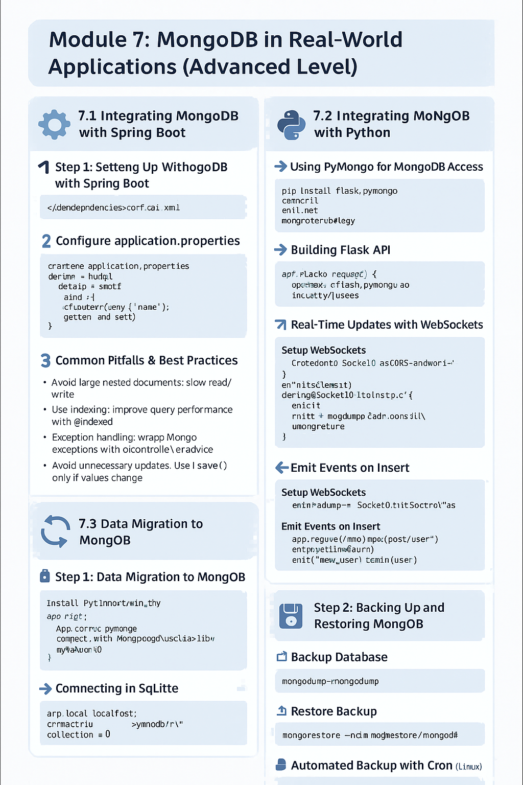

# MongoDB in Real-World Applications

## Integrating MongoDB with Spring Boot

### :white_check_mark: Step 1: Setting Up MongoDB with Spring Data MongoDB

#### Add Dependencies in `pom.xml`

```xml
<dependency>
    <groupId>org.springframework.boot</groupId>
    <artifactId>spring-boot-starter-data-mongodb</artifactId>
</dependency>
```

#### Configure `application.properties`

```properties
spring.data.mongodb.uri=mongodb://localhost:27017/mydb
```

#### Define a Model

```java
@Document(collection = "users")
public class User {
    @Id
    private String id;
    private String name;
    private String email;
    // getters and setters
}
```

#### Create Repository

```java
public interface UserRepository extends MongoRepository<User, String> {
    List<User> findByName(String name);
}
```

### :white_check_mark: Step 2: Creating RESTful APIs with MongoDB

#### REST Controller Example

```java
@RestController
@RequestMapping("/api/users")
public class UserController {

    @Autowired
    private UserRepository userRepository;

    @GetMapping
    public List<User> getAllUsers() {
        return userRepository.findAll();
    }

    @PostMapping
    public User createUser(@RequestBody User user) {
        return userRepository.save(user);
    }
}
```

### :warning: Step 3: Common Pitfalls & Best Practices

- ***Avoid large nested documents:*** They cause slow read/write.
- ***Use indexing:*** Improve query performance with `@Indexed`.
- **Exception handling:*** Wrap Mongo exceptions with `@ControllerAdvice`.
- ***Avoid unnecessary updates:*** Use `save()` only if values change.

## Integrating MongoDB with Python

### :white_check_mark: Step 1: Using PyMongo for MongoDB Access

``` bash
pip install flask pymongo flask-socketio
```

#### Connecting with MongoDB

```python
from flask_pymongo import PyMongo

app = Flask(__name__)
app.config["MONGO_URI"] = "mongodb://localhost:27017/mydb"
mongo = PyMongo(app)
```

#### CRUD Example

```python
@app.route('/api/users', methods=['POST'])
def add_user():
    data = request.get_json()
    mongo.db.users.insert_one({'name': data['name'], 'email': data['email']})
    return jsonify({"msg": "User added"}), 201
```

### :white_check_mark: Step 2: Building Flask API

#### Get All Users

```python
@app.route('/api/users', methods=['GET'])
def get_users():
    users = mongo.db.users.find()
    return jsonify([{"_id": str(u["_id"]), "name": u["name"], "email": u["email"]} for u in users])
```

### :white_check_mark: Step 3: Real-Time Updates with WebSockets

#### Setup WebSockets

```python
from flask_socketio import SocketIO, emit
socketio = SocketIO(app, cors_allowed_origins="*")
```

#### Emit Events on Insert

```python
@app.route('/api/users', methods=['POST'])
def add_user():
    data = request.get_json()
    result = mongo.db.users.insert_one({'name': data['name'], 'email': data['email']})
    user = mongo.db.users.find_one({'_id': result.inserted_id})
    user['_id'] = str(user['_id'])
    socketio.emit('new_user', user)
    return jsonify(user)
```

## Data Migration and Backup

### :arrows_counterclockwise: Step 1: Data Migration to MongoDB

#### From SQL to MongoDB Example with Python

```python
import sqlite3
import pymongo

# Connect to SQLite
conn = sqlite3.connect('old.db')
cursor = conn.cursor()
cursor.execute("SELECT name, email FROM users")
rows = cursor.fetchall()

# Connect to MongoDB
client = pymongo.MongoClient("mongodb://localhost:27017/")
db = client["mydb"]
collection = db["users"]

# Insert into MongoDB
for row in rows:
    collection.insert_one({"name": row[0], "email": row[1]})
```

### :floppy_disk: Step 2: Backing Up and Restoring MongoDB

#### Backup Database

```bash
mongodump --db=mydb --out=./backup
```

#### Restore Database

```bash
mongorestore --db=mydb ./backup/mydb
```

#### Automated Backup with Cron (Linux)

```bash
0 2 * * * mongodump --db=mydb --out=/path/to/backups/$(date +\%F)
```

This module offers both hands-on integration and real-world best practices—ideal for developers transitioning into production-level MongoDB usage.


